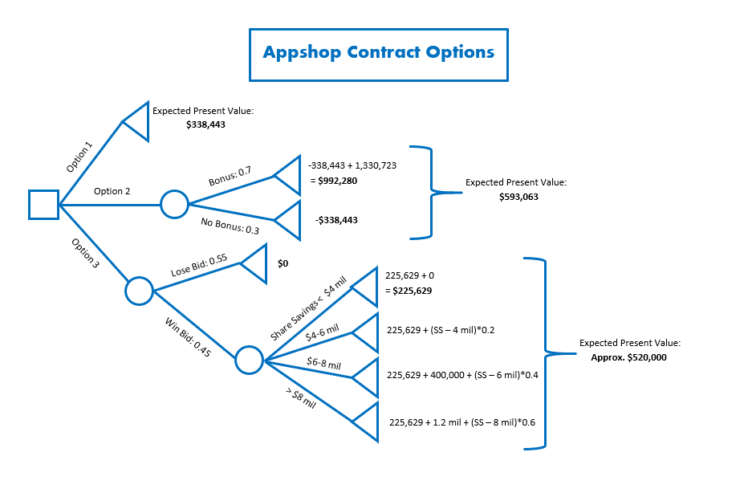

```{r setup, include=FALSE}
knitr::opts_chunk$set(echo = TRUE)
knitr::opts_knit$set(root.dir = 'C:/Users/dylan/MSBA/SM/Assignments')
```

## Summary
A company named Appshop is trying to decide the most lucrative contract terms for a new project, which requires them to implement Oracle software in seven international locations for their client. Their options include taking a lower monthly revenue than they originally proposed in the contract, an even lower monthly revenue with a potential added bonus, and to make a bid with competing offers. To help inform this problem, we built a decision tree outlining the potential options, and used this model to help calculate the expected value of each option with present value formulas, and in one case a simulation. Given this approach, we recommend that Appshop take Option 2: the bonus.

## Analysis
As previously mentioned, we have three options. In order to determine which option is best, we must calculate the expected payout in terms of present net value.

Option 1 offers a monthly revenue of 155,000 dollars.

Option 2 offers a monthly revenue of 125,000 dollars, however depending on Appshop's performance they may earn an added bonus of 1.5 million dollars.

Option 3 requires Appshop to bid for the contract against competitors. They plan to offer 150,000 dollars as a Request for Proposal. Should they get the bid, Appshop would also qualify for a potential additional revenue depending on the realized savings their project would offer the client.

### Option 1
```{r echo=FALSE}
#setwd("C:/Users/dylan/MSBA/SM/Assignments")
options(scipen = 100)
lbrHrs <- 1000
lbrCost <- 140
Mths <- 24
MonthlyCost <- lbrHrs*lbrCost
Op1Rev <- 155000
Op1Prof <- Op1Rev - MonthlyCost
DiscRate <- .005
```
In order to get the expected value of this option we must first find the monthly profit. With a cost of labor of `r lbrCost` dollars and Appshop working `r lbrHrs` hours a month, the monthly cost is `r MonthlyCost` dollars. This means that given a monthly revenue of `r Op1Rev`, Appshop's profit would be `r Op1Prof` dollars. We must then discount this to present value.
```{r}
Op1EV <- Op1Prof*((1-(1+DiscRate)^-Mths)/DiscRate)
```
Using Appshop's monthly discount rate of `r DiscRate*100`%, the expected value is `r round(Op1EV)`.

### Option 2
```{r echo=FALSE}
Op2Rev <- 125000
Op2Prof <- Op2Rev - MonthlyCost
Bonus <- 1500000
PBonus <- .7
DiscAnnual <- .0617 
EVBonus <- Bonus*((1-(1+DiscAnnual)^-2)/DiscAnnual)

Op2EVProf <- Op2Prof*((1-(1+DiscRate)^-Mths)/DiscRate)
```
The second option has a lower monthly revenue of `r Op2Rev` dollars, which is less than our monthly costs of `r MonthlyCost` meaning we have a net loss of `r Op2Prof` dollars. Discounting this to the present value the net loss is `r round(Op2EVProf)` dollars.

This option offers a bonus at the end of the `r Mths` months if the work is completed with commendable performance. The bonus is worth `r Bonus/1000000` million dollars. Appshop believes they have a `r PBonus*100`% chance of receiving this bonus. Discounting 2 years to the present day with an annual rate of `r DiscAnnual*100`%, this bonus is worth `r round(EVBonus, digits=0)` dollars.
```{r}
Op2EV <- Op2EVProf + PBonus*(EVBonus)
```
With a `r PBonus*100`% chance of receiving the bonus, the total expected value is `r round(Op2EV)` dollars. 

### Option 3
```{r echo=FALSE}
Op3Rev <- 150000
Op3Prof <- Op3Rev - MonthlyCost
PWin <- .45
SavingsLow <- 3200000
SavingsLikely <- 5600000
SavingsHigh <- 12800000
Mil4 <- 4000000
Mil6 <- 6000000
Mil8 <- 8000000

Op3EVRev <- Op3Prof*((1-(1+DiscRate)^-Mths)/DiscRate)
rep = 100000
library(triangle)
```
The final option requires Appshop to make a bid against competing offers. They plan to offer to complete the project for `r Op3Rev` dollars a month, giving them a monthly profit of `r Op3Prof` dollars. Discounted to the present, that is `r round(Op3EVRev)` dollars. Appshop believes that given their bidding strategy they have a `r PWin*100`% chance of winning the bid.

However, there is a possibility to receive a greater expected value depending on the realized savings their project will offer the client. In the appendix is a table describing the share of savings the winning bidder can expect given the realized savings of the project. 

Forecasting the potential savings of this project, Appshop predicts a low of `r SavingsLow/1000000` million dollars, a high of `r SavingsHigh/1000000` million dollars, and a most likely value of `r SavingsLikely/1000000` million dollars. 

In order to estimate the expected value of the share of savings given this triangle distribution, we simulated `r rep` trial outcomes. 
```{r}
set.seed(123)
savings <- rtriangle(n=rep,a=SavingsLow,b=SavingsHigh,c=SavingsLikely)
shares <- c()
for (i in savings) {
  if (i < Mil4) {
    shares <- c(shares, 0)
  } else if (i < Mil6) {
    shares <- c(shares, (i-Mil4)*.2)
  } else if (i < Mil8) {
    shares <- c(shares, 400000 + (i-Mil6)*.4)
  } else {shares <- c(shares, 1200000 + (i-Mil8)*.6)}
}
```
```{r echo=FALSE}
AvgShares <- mean(shares)
EVShares <- AvgShares*((1-(1+DiscAnnual)^-2)/DiscAnnual)
```
We found that the average savings were about `r round(mean(savings))` dollars, giving an average share of savings of `r round(AvgShares)` dollars. Discounted to the present that is `r round(EVShares)` dollars. 
```{r}
Op3EV <- PWin*(Op3EVRev + EVShares)
```
Given the probability of winning the bid, the expected value of this option is `r round(Op3EV)` dollars.

## Illustration


## Conclusion
Our recommendation is for Appshop to choose the contract with the bonus, because it has the highest expected value. Despite this, there is still a `r (1-PBonus)*100`% chance of walking away with a net loss of `r round(Op2EVProf)` dollars. This recommendation assumes that Appshop is risk-neutral. If Appshop is more risk-averse, they may feel safer taking Option 1 which guarantees a positive net return. However, if Appshop were more risk-savvy they may be inclined to choose Option 3. With a `r (1-PWin)*100`% chance of walking away with nothing, they are more likely to win a coin toss; However, despite a `r (PBonus-PWin)*100`% lower probability of a net gain than our current recommendation, option 3 offers the highest maximum revenue possible. 

Another pitfall is that we are relying on the accuracy of numbers provided by Appshop to make our recommendations. Should the company's actual chances of winning the bid be higher, or perhaps their chances of getting the bonus be lower, our recommendation may have been different. We have been provided no information with regard to how these numbers were calculated or any confidence interval with which to allow for sensitivity analysis. 

We must also consider that there are other variables not covered or unknown to Appshop, such as a new potential competitor who can outbid Appshop. When considering a final decision, it is imperative to look at the pitfalls of this analysis as this recommendation would have Appshop take significant risks, including possibility of a severe loss. In addition to company resources spent on the OS-7 project, Clark's compensation and workers' hourly revenue depend on the financial performance of this project, and ultimately a more holistic approach involving risk consideration and sensitivity analysis is advised.

## Appendix


```{r savings, echo=FALSE}
hist(savings/1000000, xlab="Savings (in $ millions)", main = "AppShop Project Savings", col="dodgerblue1")
```

```{r shares, echo=FALSE}
hist(shares, xlab="Share of Savings (in dollars)", main = "AppShop Share of Savings", col="dodgerblue1")
```
